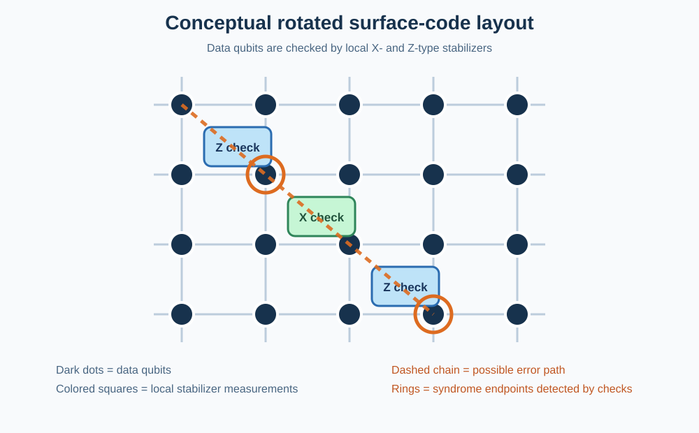

# Quantum-Correction

Surface-code quantum error-correction simulation with Stim and PyMatching.

## What this project is studying

This project asks:

> How do errors correlated across time affect surface-code error correction, and can a decoder that understands temporal correlations outperform standard MWPM?

The project is being built in stages:

1. Establish an IID (memoryless) noise baseline.
2. Add temporally correlated Ornstein-Uhlenbeck (OU) noise with correlation time `tau_c`.
3. Measure how temporal correlation changes the logical error rate.
4. Add decoder memory `T` and test the hypothesis that correlation-aware decoding improves when `T` is comparable to or larger than `tau_c`.

The current repository implements stage 1 completely.

## Start here

The main simulation path is:

```text
run baseline -> build surface-code circuit -> apply IID noise
             -> Stim detector events -> MWPM decoder -> logical error rate
```

Run the tests first, then run the baseline:

```bash
PYTHONPATH=. pytest -q
MPLCONFIGDIR=/tmp/qc-matplotlib PYTHONPATH=. python experiments/baseline_mwpm.py --shots 1000
```

The larger default run uses 10,000 shots per point. Results are generated in
`output/results/` and are intentionally ignored by Git.

## Quick start

Requirements: Python 3.11 or newer and a terminal.

```bash
git clone <YOUR_GITHUB_REPOSITORY_URL>
cd Quantum-Correction
python -m venv .venv
source .venv/bin/activate       # macOS/Linux
# .venv\\Scripts\\activate     # Windows PowerShell
python -m pip install --upgrade pip
python -m pip install -r requirements.txt
```

Run the tests:

```bash
PYTHONPATH=. pytest -q
```

## Interactive dashboard

Install the dashboard dependency if needed:

```bash
python -m pip install streamlit pandas
```

Start the interactive dashboard:

```bash
streamlit run dashboard/noise_dashboard.py
```

The sidebar controls gate, measurement, and reset IID rates, code distance,
QEC rounds, and Monte Carlo shots. The dashboard runs the actual Stim + MWPM
pipeline and immediately displays a result graph, a plain-language
explanation, run history, and a distance-comparison sweep for `d = 3, 5, 7`.
A separate literature panel
loads the documented mechanism records. Willow timescales and mechanisms that
are not yet implemented as Stim channels are shown as references, not silently
treated as simulated hardware noise.

For a browser-only front-end preview, open `dashboard/noise_dashboard.html`
directly. It provides interactive controls and an event-pressure preview, but
it does not execute Stim or MWPM; use the Streamlit dashboard for real decoded
logical-error results.

Run the complete IID experiment:

```bash
MPLCONFIGDIR=/tmp/qc-matplotlib PYTHONPATH=. python experiments/baseline_mwpm.py
```

The experiment tests distances `d = 3, 5, 7`, five physical error probabilities, and 10,000 Monte Carlo shots per point. It creates:

- `output/results/iid_baseline.csv`: numerical results.
- `output/results/iid_baseline.png`: logical-error-rate plot.

To run a faster smoke test:

```bash
PYTHONPATH=. python experiments/baseline_mwpm.py --shots 100
```

## Surface code in plain language

The surface code stores one logical qubit across many physical qubits arranged on a 2D grid. It does not repeatedly measure the logical qubit directly. Instead, it measures local **stabilizers**. A stabilizer is a small parity check whose expected value is known for the encoded state.

For a surface code, checks are made from products of Pauli operators:

- An X-type stabilizer is a product of X operators on nearby data qubits.
- A Z-type stabilizer is a product of Z operators on nearby data qubits.

The code state is designed to be a +1 eigenstate of its stabilizers. A physical error can anticommute with some checks and change their measured value from +1 to -1. The pattern of changed checks is the **syndrome**. The syndrome reveals where an error is likely to be without revealing the logical quantum information.



The diagram is a conceptual layout. Stim generates the complete repeated-measurement circuit, including data qubits, ancilla measurement qubits, detector definitions, and a final logical observable.

## Why stabilizers identify errors

Suppose a single data qubit suffers an X error. X commutes with X-type checks, but it anticommutes with neighboring Z-type checks. Those Z checks flip from +1 to -1. A Z error produces the complementary pattern on X-type checks. A Y error behaves as both X and Z, so it can affect both families.

The important fact is that errors leave endpoints in the syndrome. A chain of physical errors usually produces syndrome changes at its two ends; errors in the middle cancel because each affected check is flipped twice. A chain that reaches a boundary can have only one visible endpoint. A chain that connects the appropriate boundaries can implement a logical error while leaving no detectable endpoint, which is why the code distance matters.

## What Stim is doing

`src/circuits/surface_code.py` calls Stim's generated rotated-memory circuit:

```python
stim.Circuit.generated(
    "surface_code:rotated_memory_z",
    distance=distance,
    rounds=rounds,
    **noise,
)
```

Stim constructs and simulates the stabilizer circuit efficiently. Each round measures local checks. A detector compares related check measurements across time. A detector event means that a check result changed unexpectedly relative to the circuit's noiseless behavior. The final observable records whether the logical Z-memory experiment experienced a logical flip.

The simulator returns two arrays for many shots:

- `detectors`: the syndrome/detector-event bits given to the decoder.
- `observables`: the actual logical observable outcomes used to score the decoder.

## The current IID noise model

`src/noise/iid_noise.py` maps one probability `p` to three Stim noise settings:

- `after_clifford_depolarization`: random Pauli noise after Clifford operations.
- `before_measure_flip_probability`: classical measurement-result flips.
- `after_reset_flip_probability`: errors immediately after reset operations.

IID means each error event is sampled independently. There is no temporal memory, so this baseline does not yet model `tau_c`.

## How MWPM decodes

`src/decoders/mwpm.py` asks Stim for a detector error model. This model describes which physical faults can create which detector-event patterns and assigns probabilities/weights to those faults. PyMatching converts that model into a graph.

When detector events are observed, MWPM pairs likely syndrome endpoints using minimum total edge weight. The edge weight is related to how unlikely the corresponding error chain is. The chosen set of chains gives a correction hypothesis. If that hypothesis has the wrong logical parity, the shot is counted as a logical failure.

The decoder does not need to know the original random errors. It infers the most likely explanation from the syndrome. This is why the project compares the decoder's `predictions` with Stim's `observables` rather than comparing against hidden physical-error samples.

## End-to-end data flow

```text
baseline_mwpm.py
        |
        v
surface_code.py ----> iid_noise.py
        |                    |
        +-------- Stim ------+
                 |
                 v
       detector events + observables
                 |
                 v
             mwpm.py
                 |
                 v
       logical predictions and failures
                 |
                 v
          CSV + log-log plot
```

## File-by-file guide

| File | Role |
| --- | --- |
| `src/circuits/surface_code.py` | Validates parameters and creates the rotated surface-code Stim circuit. |
| `src/noise/iid_noise.py` | Defines the independent physical-noise parameters. |
| `src/decoders/mwpm.py` | Builds a PyMatching decoder from Stim's detector error model. |
| `experiments/baseline_mwpm.py` | Runs the parameter sweep, samples shots, scores logical failures, and saves results. |
| `experiments/individual_noise_baseline.py` | Compares gate, measurement, reset, and combined IID noise. |
| `experiments/compare_literature_timescales.py` | Demonstrates why IID noise cannot reproduce physical memory times. |
| `experiments/willow_reference_check.py` | Prints Willow reference timescales and samples persistent leakage states. |
| `src/noise/willow_model.py` | Stores source-backed Willow reference parameters and timescale formulas. |
| `docs/noise_literature_database.md` | Editable literature database with mechanisms, timescales, and citations. |
| `output/pdf/noise_literature_database.pdf` | Readable PDF version of the complete literature database. |
| `docs/QEC_Guide.pdf` | Supplemental seven-page QEC guide. |
| `tests/test_mwpm_setup.py` | Verifies that the surface-code circuit creates an MWPM decoder. |
| `tests/test_iid_baseline.py` | Checks validation, zero-noise behavior, and sweep output. |
| `requirements.txt` | Lists all Python libraries required to run the project. |
| `docs/surface_code_diagram.svg` | Conceptual picture of data qubits and X/Z stabilizer checks. |

## Interpreting the baseline plot

The x-axis is physical error probability `p`; the y-axis is logical error rate. Both are logarithmic. Each curve represents one code distance. At low enough physical noise, larger distance should generally suppress logical errors more strongly. At high noise, the code can approach or exceed its useful operating regime, so curves can converge or behave non-monotonically due to finite sampling and threshold effects.

Zero observed failures are displayed at a small plotting floor because zero cannot be shown on a logarithmic y-axis. The CSV retains the true value `0.0`.

## Literature-timescale comparison

The separate script `experiments/compare_literature_timescales.py` checks what the current independent-noise model can and cannot reproduce. It estimates the lag-1 autocorrelation of an IID error stream and runs a controlled exponential-fit check for reported exponential timescales. The reported literature value is used as a synthetic test parameter, so a successful fit validates the analysis code, not the hardware measurement. The script correctly marks T1, T2, leakage, 1/f, drift, crosstalk, and burst times as not reproduced by an IID stream.

```bash
PYTHONPATH=. python experiments/compare_literature_timescales.py
```

The report is written to `output/results/literature_timescale_check.csv`. A physical comparison requires time-ordered experimental data or an explicitly correlated noise model; it cannot be obtained from IID sampling alone.

## Willow reference calibration

The first evidence-based realism layer uses measurements from Google's Willow
surface-code experiment. Run it with:

```bash
PYTHONPATH=. python experiments/willow_reference_check.py --injection-probability 0.01
```

The check includes the reported mean `T1 = 68 us`, `T2,CPMG = 89 us`, QEC-cycle
time `1.1 us`, leakage lifetime `4.4 cycles`, and bulk detection-event rates
for `d = 3, 5, 7`. It derives only quantities that follow directly from those
measurements. The leakage injection probability is a user input because the
paper reports the leakage lifetime, not a universal injection rate.

This is intentionally a calibration/reference check, not a claim that the
current IID Stim circuit reproduces Willow's operation-specific error budget.
The next upgrade is to add measured one-qubit, two-qubit, measurement, reset,
and leakage-injection rates as separate inputs.

## Individual implemented-noise results

To measure the effect of each noise component separately, run:

```bash
MPLCONFIGDIR=/tmp/qc-matplotlib PYTHONPATH=. python experiments/individual_noise_baseline.py
```

This compares `gate_only`, `measurement_only`, `reset_only`, and `combined` noise for distances `d = 3, 5, 7`. Results are saved to `output/results/individual_noise_baseline.csv`. These are the only independent components currently implemented in the Stim circuit. Leakage, T1/T2, crosstalk, 1/f noise, calibration drift, and high-energy bursts are documented but are not yet simulated by the baseline.

## Reproducibility notes

The experiment uses Monte Carlo sampling, so nonzero results vary slightly between runs unless a simulator seed is added. More shots give more precise estimates. For an estimated logical error rate `L` from `N` shots, the statistical uncertainty is approximately `sqrt(L(1-L)/N)`.

## Planned OU-noise extension

The next research module will be `src/noise/ou_noise.py`. It will generate a temporally correlated process using Euler-Maruyama discretization with target autocorrelation

```text
C(delta_t) = exp(-delta_t / tau_c)
```

That module should first be tested independently by estimating its autocorrelation. Once verified, the same surface-code and scoring pipeline can compare IID and OU noise. The final research step is a decoder that uses a time window or memory `T` to exploit those correlations.

## License and status

This is a research prototype. The IID baseline is operational; OU noise and correlation-aware MWPM are planned extensions.
